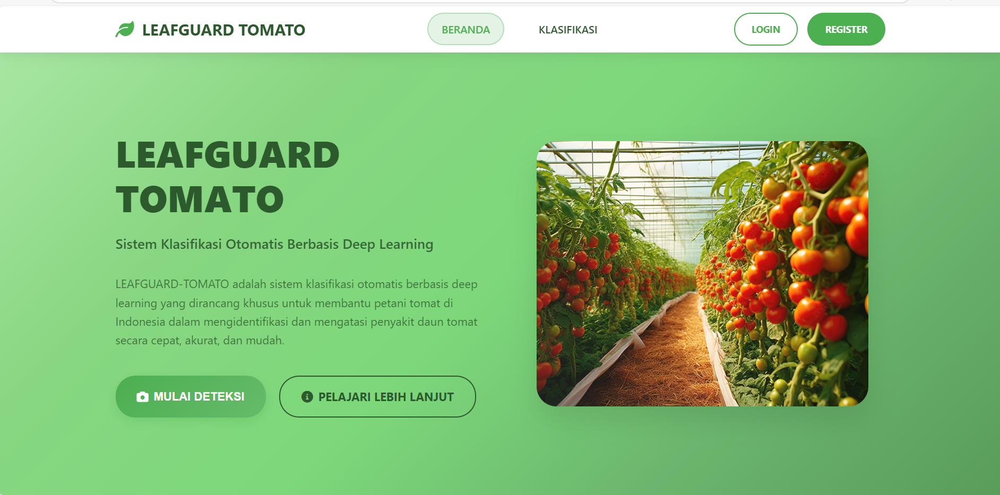

# LEAFGUARD-TOMATO 🍅🔍

**Sistem Klasifikasi Otomatis Penyakit Daun Tomat Menggunakan Deep Learning untuk Mendukung Petani Tomat di Indonesia**

## 📋 Daftar Isi
- [Tentang Proyek](#-tentang-proyek)
- [Fitur Utama](#-fitur-utama)
- [Teknologi yang Digunakan](#-teknologi-yang-digunakan)
- [Dataset](#-dataset)
- [Instalasi](#-instalasi)
- [Penggunaan](#-penggunaan)
- [Kontributor](#-kontributor)
- [Lisensi](#-lisensi)

## 🌟 Tentang Proyek

LEAFGUARD-TOMATO adalah solusi teknologi inovatif yang dirancang untuk membantu petani tomat di Indonesia mengidentifikasi penyakit pada daun tomat secara cepat dan akurat. Sistem ini menggunakan teknologi deep learning untuk mengklasifikasikan 11 jenis penyakit dan kondisi daun sehat.

<div align="center">
  
  <p><i>Tampilan Platform LEAFGUARD TOMATO</i></p>
</div>

### 🎯 Latar Belakang Masalah
- Kerugian hasil panen tomat mencapai **40-60%** akibat penyakit tanaman (Kementerian Pertanian, 2023)
- Keterlambatan identifikasi penyakit menjadi masalah utama petani
- Diagnosis manual memerlukan keahlian khusus yang tidak semua petani miliki

### 🚀 Solusi yang Ditawarkan
- **Diagnosis Cepat**: Identifikasi penyakit dalam hitungan detik
- **Akurasi Tinggi**: Model dengan akurasi >90% pada kondisi optimal
- **Mudah Digunakan**: Antarmuka web responsif yang intuitif
- **Rekomendasi Praktis**: Saran penanganan spesifik untuk setiap penyakit
- **Aksesibilitas**: Dapat diakses melalui perangkat mobile

## ✨ Fitur Utama

### 1. 🔬 Modul Klasifikasi Penyakit
Mengidentifikasi 11 kategori kondisi daun tomat:
- **Early Blight** (*Alternaria solani*)
- **Late Blight** (*Phytophthora infestans*)
- **Leaf Mold** (*Fulvia fulva*)
- **Bacterial Spot** (*Xanthomonas spp.*)
- **Septoria Leaf Spot** (*Septoria lycopersici*)
- **Tomato Yellow Leaf Curl Virus**
- **Target Spot** (*Corynespora cassiicola*)
- **Tomato Mosaic Virus**
- **Spider Mites** (*Tetranychus urticae*)
- **Powdery Mildew** (*Leveillula taurica*)
- **Healthy** (Daun Sehat)

### 2. 📸 Sistem Upload Gambar
- Panduan visual untuk pengambilan foto optimal
- Dukungan format: JPG, JPEG dan PNG
- Validasi kualitas gambar otomatis

### 3. 📊 Hasil Klasifikasi Visual
- Tampilan persentase keyakinan diagnosis
- Informasi detail tentang penyakit
- Cara penanganan penyakit
- Visualisasi yang mudah dipahami

### 4. 💡 Rekomendasi Penanganan
- Saran spesifik untuk setiap jenis penyakit
- Rekomendasi pestisida organik/kimia
- Tindakan pencegahan berkelanjutan

### 6. 📚 Data Penyakit
- Informasi lengkap setiap penyakit
- Gambar referensi berkualitas tinggi
- Faktor risiko dan cara pencegahan

### 7. 📝 Sistem Riwayat
- Penyimpanan hasil klasifikasi sebelumnya

### 8. 📖 Panduan Penggunaan
- Tutorial interaktif step-by-step
- Tips pengambilan foto yang baik

## 🛠 Teknologi yang Digunakan

### Machine Learning
- **TensorFlow 2.x** - Framework deep learning utama
- **Python 3.8+** - Bahasa pemrograman
- **NumPy** - Operasi matematika dan array
- **Pandas** - Manajemen dan analisis data
- **Matplotlib** - Visualisasi training dan evaluasi
- **Flask** - API backend untuk model serving

### Frontend & Backend
- **Laravel 11** - Framework PHP untuk frontend dan backend
- **MySQL 8.0** - Database relasional
- **HTML5/CSS3** - Markup dan styling
- **JavaScript** - Interaktivitas frontend

### Deployment & DevOps
- **Railway** - Platform deployment aplikasi web
- **Hugging Face** - Hosting model machine learning
- **Git & GitHub** - Version control dan kolaborasi

## 📊 Dataset

### PlantVillage Dataset
- **Sumber**: [Kaggle Tomato Leaves Dataset](https://www.kaggle.com/datasets/ashishmotwani/tomato)
- **Total Gambar**: 20,000+ gambar berlabel
- **Kategori Tomat**: 11 kelas (10 penyakit + 1 sehat)
- **Resolusi**: Berbagai resolusi, dinormalisasi ke 224x224 px
- **Format**: JPG, JPEG dan PNG

## 🚀 Instalasi

# LEAFGUARD-TOMATO: Project Setup & Installation Guide

## 🚀 Instalasi

### 1. Clone Repository
```bash
git clone https://github.com/yusufgithub123/laravel-tomato.git
cd laravel-tomato
```

### 2. Setup Backend (Laravel)
```bash
# Install dependencies
composer install

# Setup environment
cp .env.example .env
php artisan key:generate

# Configure database di .env
DB_CONNECTION=mysql
DB_HOST=127.0.0.1
DB_PORT=3306
DB_DATABASE=leafguard_tomato
DB_USERNAME=your_username
DB_PASSWORD=your_password

# Run migrations
php artisan migrate --seed

# Storage link
php artisan storage:link
```

### 3. Setup ML Model API

#### Download Model File Terlebih Dahulu
```bash
# Masuk ke folder ml-api
cd ML-Tomato-api

# Download model.h5 dari Google Drive
# Kunjungi link berikut dan download file model.h5:
# https://drive.google.com/file/d/1FeIL-xaqGNcq9xwa8GITdrRQZ1OKZoOH/view?usp=sharing

# Pastikan file model.h5 sudah berada di dalam folder ML-Tomato-api/
# Struktur folder harus seperti ini:
# ML-Tomato-api/
# ├── model.h5          <- File yang baru didownload
# ├── requirements.txt
# ├── Dockerfile
# ├── app.py
# ├── README.md
# └── gitattributes
```

#### Install Dependencies dan Setup Environment
```bash
# Install Python dependencies
pip install -r requirements.txt

# Setup environment variables
cp .env.example .env
# Configure FLASK_APP, MODEL_PATH, etc. di file .env

# Pastikan MODEL_PATH di .env mengarah ke model.h5
# Contoh: MODEL_PATH=./model.h5
```

#### Run Flask API
```bash
# Run Flask API
python app.py
```

### 4. Run Application
```bash
# Laravel development server (dari root directory)
php artisan serve

# ML-Tomato-API (di terminal terpisah, dari folder ML-Tomato-api)
cd ML-Tomato-API && python app.py
```

## ⚠️ Catatan Penting

- **Model File**: File `model.h5` tidak disertakan dalam repository GitHub karena keterbatasan ukuran file. Pastikan untuk mendownload terlebih dahulu sebelum menjalankan ML-Tomato-API.
- **Struktur Folder**: Pastikan file `model.h5` berada di dalam folder `ML-Tomato-API/` setelah didownload.
- **Dependencies**: Pastikan semua dependencies Python sudah terinstall dengan benar sebelum menjalankan Flask API.

## 🔗 Link Download Model

**Google Drive**: [Download model.h5](https://drive.google.com/file/d/1FeIL-xaqGNcq9xwa8GITdrRQZ1OKZoOH/view?usp=sharing)

*Ukuran file: ~200MB+*

## 💻 Penggunaan

### Langkah 1: Daftar Akun
1. Klik tombol **"REGISTER"** di halaman utama
2. Isi formulir pendaftaran:
   - Nama Lengkap
   - Email
   - Password (minimal 8 karakter)
   - Konfirmasi Password
3. Konfirmasi Password
4. Klik tombol **"DAFTAR"**
5. Akun Anda siap digunakan

### Langkah 2: Login
1. Klik tombol **"LOGIN"** di halaman utama
2. Masukkan email dan password yang sudah didaftarkan
3. Centang **"Ingat saya"** jika ingin tetap login
4. Klik tombol **"MASUK"**

### Langkah 3: Deteksi Penyakit
1. Masuk ke menu **"KLASIFIKASI"**
2. **Persiapan Foto:**
   - Gunakan pencahayaan alami/cukup terang
   - Ambil foto dari jarak 15-20 cm dari daun
   - Pastikan daun terlihat jelas tanpa bayangan
3. **Upload Gambar:**
   - Seret & lepas gambar ke area yang tersedia, ATAU
   - Klik untuk memilih file dari perangkat
   - Klik tombol **"KLASIFIKASI SEKARANG"**

### Langkah 4: Lihat Hasil
Setelah proses klasifikasi selesai, Anda akan mendapat:
- **Status Validasi**: Konfirmasi gambar tervalidasi
- **Kelas Penyakit**: Jenis penyakit yang terdeteksi
- **Tingkat Kepercayaan**: Persentase akurasi deteksi
- **Gejala**: Deskripsi kondisi yang terdeteksi
- **Penyebab**: Faktor penyebab penyakit
- **Rekomendasi**: Saran penanganan yang sesuai

### Langkah 5: Simpan Riwayat
Setelah melihat hasil klasifikasi:
1. **Otomatis Tersimpan**: Data hasil klasifikasi akan masuk ke riwayat secara otomatis
2. **Akses Riwayat**: Klik menu **"RIWAYAT"** untuk melihat semua hasil sebelumnya
   - **Data Tersimpan**: Foto daun yang dianalisis
   - Hasil deteksi penyakit
   - Tingkat akurasi (persentase kepercayaan)
   - Tanggal dan waktu klasifikasi
   - Status kondisi (Sehat/Terinfeksi)

### Fitur Tambahan
- **Responsif Mobile**: Platform dapat diakses melalui smartphone dan tablet
- **Multi-platform**: Tersedia untuk desktop, mobile, dan tablet
- **Panduan Visual**: Tutorial interaktif untuk penggunaan optimal
### Production (Railway + Hugging Face)

## 👥 Kontributor

### Tim CC25-CF276

#### Machine Learning Team
- **Christofel A Simbolon** (MC319D5Y2058) - Universitas Sumatera Utara
- **Henry Dwi Prana Sitepu** (MC319D5Y2229) - Universitas Sumatera Utara  
- **Andika Syarif Hidayatullah** (MC747D5Y0795) - Universitas Muhammadiyah Banjarmasin
- 
#### Frontend & Backend Team
- **Muhammad Ihsan** (FC747D5Y1120) - Universitas Muhammadiyah Banjarmasin
- **Yusuf Alfarabi Natawiyanta** (FC747D5Y1729) - Universitas Muhammadiyah Banjarmasin
- **Anwar** (FC747D5Y1626) - Universitas Muhammadiyah Banjarmasin

### Advisor
- **Muhammad Rafi Sudrajat** (MC25-152) - Bangkit Academy Mentor

## 📞 Kontak & Support

### Tim Support
- **WhatsApp**: +62 831-5072-4130 (Muhammad Ihsan)

## 📜 Lisensi

Proyek ini dilisensikan under [MIT License](LICENSE).

```
MIT License

Copyright (c) 2025 LEAFGUARD-TOMATO Team

Permission is hereby granted, free of charge, to any person obtaining a copy
of this software and associated documentation files (the "Software"), to deal
in the Software without restriction, including without limitation the rights
to use, copy, modify, merge, publish, distribute, sublicense, and/or sell
copies of the Software, and to permit persons to whom the Software is
furnished to do so, subject to the following conditions:

The above copyright notice and this permission notice shall be included in all
copies or substantial portions of the Software.

THE SOFTWARE IS PROVIDED "AS IS", WITHOUT WARRANTY OF ANY KIND, EXPRESS OR
IMPLIED, INCLUDING BUT NOT LIMITED TO THE WARRANTIES OF MERCHANTABILITY,
FITNESS FOR A PARTICULAR PURPOSE AND NONINFRINGEMENT. IN NO EVENT SHALL THE
AUTHORS OR COPYRIGHT HOLDERS BE LIABLE FOR ANY CLAIM, DAMAGES OR OTHER
LIABILITY, WHETHER IN AN ACTION OF CONTRACT, TORT OR OTHERWISE, ARISING FROM,
OUT OF OR IN CONNECTION WITH THE SOFTWARE OR THE USE OR OTHER DEALINGS IN THE
SOFTWARE.

---

LEAFGUARD-TOMATO - *Melindungi Tanaman, Meningkatkan Hasil Panen* 🍅🛡️

Dibuat dengan ❤️ oleh Tim CC25-CF276 untuk petani Indonesia
